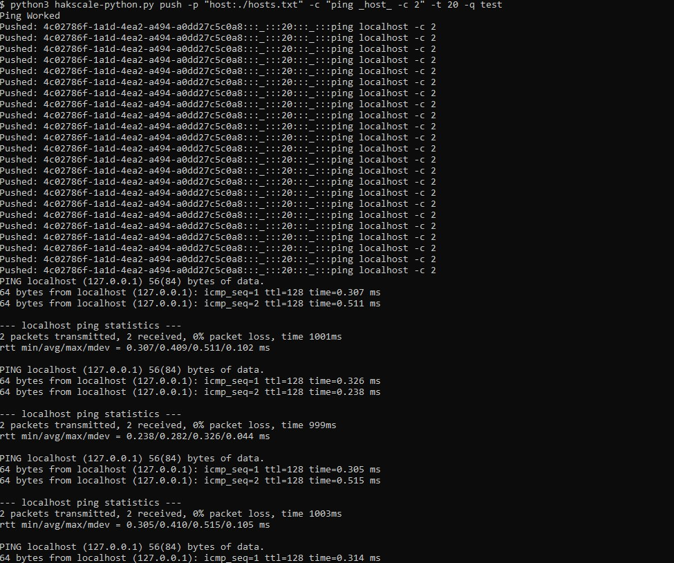
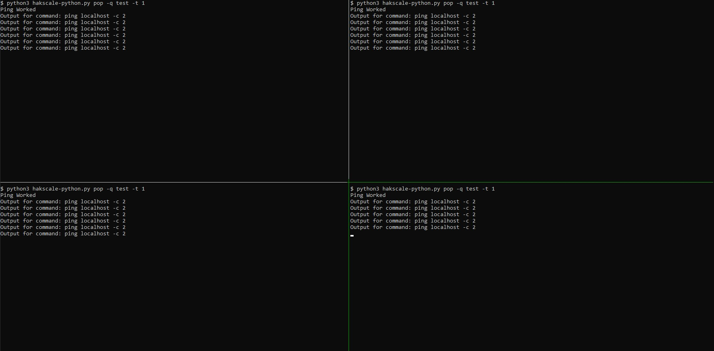
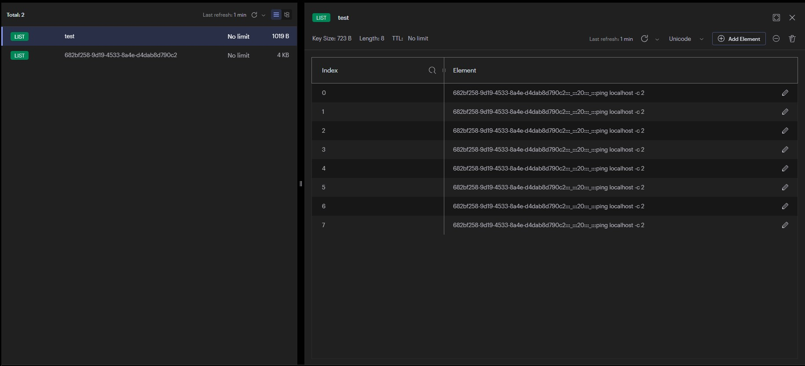
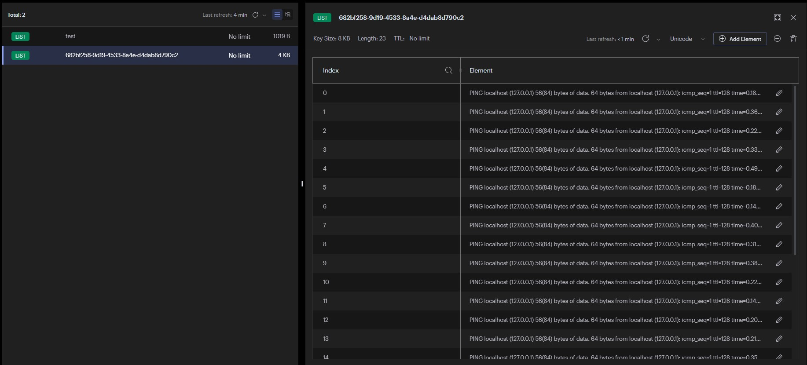

# Hakscale Python

Hakscale Python is a simple script that demonstrates the use of Python for queue-based task execution and result retrieval. It is designed to help me understand how to use Python for task distribution among various systems and how to push and retrieve results from a queue.

## Why Python?

This project is developed in Python primarily as a learning exercise. While Python might not be the fastest language for this kind of task, it is an excellent language for learning and experimentation. Plus, why not?

## Getting Started

### Prerequisites

- Python 3
- Redis server

### Installation

To install the required Python libraries, run the following command:

```sh
python3 -m pip install -r requirements.txt
```
# Usage
Hakscale Python script can be used to push commands to a queue and execute them in a First-In-First-Out (FIFO) manner across distributed workers. The results are then pushed back to the queue, which can be retrieved by the client.

### Example
- Start monitoring the test queue with the following command:
```
python3 hakscale-python.py pop -q test -t 1
```
This command polls the queue every second for a task to execute and pushes the output to the queue by the ID using 1 thread.

- With a `hosts.txt`, or whatever file, you can run the following command:
```
python3 hakscale-python.py push -p "host:./hosts.txt" -c "ping _host_ -c 2" -t 20 -q test
```
This command pushes individual variations to the queue with the same ID.

On the workers, you can see the tasks distributed in a FIFO order. These will be pushed in sequence to the queue, by ID, to allow the client to get results seen above.

The following image shows what the queue looks like when the client pushes a command and before the workers pop the command off for execution.

This image shows how the worker pushes the results to the queue for the client to pop off and return back to the terminal stdout. Notice the ID is the same between the photos. The difference in the number of items on the queues is because some of the commands were already popped off the queue before taking the screenshot.

Once both the client and the worker have completed processing results or executing tasks, the queue is empty.

# Simply Put
Hakscale Python is a simple yet powerful example of how Python can be used for distributed task execution using a queue. It's an excellent tool for learning and understanding the basics of task queues and distributed systems.
<br><br><br>


---

Original Readme below

---
<br><br>

# What is this?

Hakscale allows you to scale out shell commands over multiple systems with multiple threads on each system. The key concept is that a master server will _push_ commands to the queue, then multiple worker servers _pop_ commands from the queue and execute them. The output from those commands will then be sent back to the master server.

For example, if you want to run a tool like httpx against 1 million hosts in `hosts.txt`, you could run:

```
hakscale push -p "host:./hosts.txt" -c "echo _host_ | httpx" -t 20
```

This would create 1 million commands and send them to a queue. Then, you can set up as many servers (workers) as you like to pull those commands off the queue and execute them in parallel. To do this, you can simply run the following command:

```
hakscale pop -t 20
```

Once the command is complete, the output is sent back to the master server. It feels like you are running a command and viewing output as normal, but the actual work will be distributed over many other machines, so it is much faster.

# What can it be used for?

It's a very simple way to distribute scans/commands across many systems. It's perfect for large-scale internet scanning because it is _way_ faster than attempting to do it from a single host. There are probably also a bunch of other uses that I can't think of right now.

# How do I use it?

When you're pushing commands to the queue - hakscale will automatically generate the commands based on input from a file. For example, if you wanted to ping a list of hosts, you could use this:

```
hakscale push -p "host:./hosts.txt" -c "ping _host_" -t 20
```

In the command above, the `-p` option specifies a variable name "host", and then a file to take the variables from (hosts.txt). In the `-c` option, the position of the variable in the command is defined with an underscore on either side: `_hosts_`. Hakscale will automatically generate the commands based on this input. For example, if the hosts file contained the following:

```
google.com
bing.com
hakluke.com
haksec.io
```

Then the commands generated would be:

```
ping google.com
ping bing.com
ping hakluke.com
ping haksec.io
```

You can also specify multiple variables, for example:

```
hakscale push -p "param1:./file1.txt,param2:./file2.txt" -c "nmap -A _param1_ _param2_" -t 20
```

If multiple variables are specified, every unique combination of those variables is generated.

# Options

There are two subcommands, `push` and `pop`.

The "push" mode is how you get commands ONTO the queue, and the "pop" mode is how you get commands OFF the queue and execute them. You use "push" on the master server, and "pop" on the workers.

## Push options

- `-v` verbose mode
- `-c` the command you wish to scale, including placeholders
- `-q` the name of the queue that you would like to push jobs to
- `-p` define parameters (variables, as described above)
- `-test` test mode - print the commands to the terminal but don't actually push them to redis
- `-t` timeout, set a timeout for the commands (in seconds)

## Pop options

- `-v` verbose mode
- `-q` name of the queue that you would like to get the jobs from
- `-t` the number of threads that you'd like to use

# Setup

To install the binary on your machine:

```
go install github.com/hakluke/hakscale@latest
```

The basic requirements are:

- A computer to push commands
- 1 or more worker computers (usually multiple VPSs)
- A Redis server

You can set it up however you want, but if you would like to use Digital Ocean:

- Set up Redis server ([Digital Ocean can do this for you in seconds, click here for $100 credit](https://m.do.co/c/ac22891d18e8))
  - Log in to Digital Ocean
  - Create > Databases > Redis
  - Follow the prompts to create the database and save the details
- Spin up a bunch of droplets (or any VPS) to use as workers
  - Create > Droplets
- Set up hakscale config file to include the Redis server details
  - Save the following to `~/.config/haktools/hakscale-config.yml` on every VPS/computer that you want to use hakscale with

```
redis:
  host: your-redis-host
  port: your-redis-port
  password: your-redis-password
```

- Run `hakscale pop` on the workers

You're now ready to start distributing your commands!
